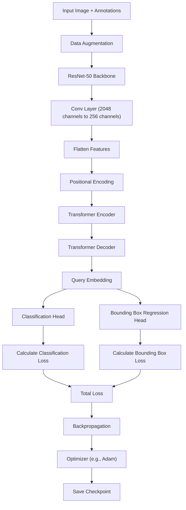

# 🔍 DETR Object Detection Project

A powerful PyTorch Lightning implementation of Detection Transformer (DETR) for object detection, with seamless Roboflow integration.


### ⚛️Struktur Model



## 🌟 Highlights

- 🚀 Fast and efficient object detection
- 🎯 Real-time inference capabilities
- 📊 Comprehensive evaluation metrics
- 🔄 Custom dataset support via Roboflow
- 📈 TensorBoard visualization
- 🎮 CUDA-enabled GPU acceleration

## 🛠️ Installation

### 1️⃣ Clone the Repository
```bash
git clone https://github.com/HulwanulAzkaP/detr_customdateset_roboflow.git
cd detr_customdataset_roboflow
```

### 2️⃣ Install Dependencies
```bash
pip install torch torchvision pytorch-lightning transformers roboflow opencv-python supervision
```

## ⚙️ Configuration Steps

### 1. 🔑 Roboflow Setup

#### In `config.py`:
```python
ROBOFLOW_API_KEY = "your_api_key_here"  # Add your key here
```

#### In `src/config/default.py`:
```python
@dataclass
class DataConfig:
    roboflow_api_key: str = "your_api_key_here"  # Add your key here
    workspace: str = "your-workspace"     # Your workspace
    project: str = "your-project"         # Your project
    version: int = 1                      # Version number
```

### 2. 📁 File Paths

#### 📍 In `train.py`:
```python
MODEL_PATH = os.path.join(HOME, 'output_model')
```

#### 📍 In `inference/inference_detr.py`:
```python
model_path = "../output_model/model.safetensors" //change the folder from your project
dataset_path = "path/to/your/dataset"
```

#### 📍 In `evaluate.py`:
```python
dataset_path = "path_roboflow_project" //change the folder from your project
```

## 🚀 Usage Guide

### 📚 Training

1. Verify your dataset structure:
```
dataset/
├── train/
├── valid/
└── test/
```

2. Start training:
```bash
python train.py
```

### 📊 Evaluation

```bash
python evaluate.py
```

### 🎥 Inference

For webcam:
```bash
python inference/inference_detr.py //to use webcam un comment the webcam code
```

For video:
```bash
python inference/inference_detr.py //then input your filename include the extension(.mp4)
```

## 📂 Project Structure

```
detr_customdataset_roboflow/
├── data/
│   └── dataset.py              # Dataset handling and preprocessing
├── inference/
│   ├── inference_detr.py       # Real-time inference implementation
│   └── Test.mp4               # Sample test video
├── models/
│   └── detr.py                # DETR model implementation
├── scripts/
│   └── train.py               # Training script
├── src/
│   ├── config/
│   │   └── default.py         # Configuration parameters
│   ├── data_handling/
│   │   ├── dataloader.py      # Data loading utilities
│   │   └── dataset.py         # Dataset class definitions
│   ├── model/
│   │   └── detr.py           # Model architecture
│   └── utils/
│       ├── helpers.py         # Utility functions
│       ├── logging_config.py  # Logging configuration
│       └── config.py         # Global configuration
├── evaluate.py                # Evaluation script
└── train.py                  # Main training script
```

## 📊 Training Monitoring

Launch TensorBoard:
```bash
tensorboard --logdir logs/ //optional
```

📈 View:
- Loss curves
- Validation metrics
- Learning rates
- Model predictions

## 📋 Evaluation Metrics

### 🎯 Performance Metrics
- Average Precision (AP)
- IoU thresholds
- Object size performance
- Recall rates

### 📸 Visual Output
- Bounding box visualization
- Ground truth comparison
- Confidence scoring

## ❗ Troubleshooting

### 🔑 Roboflow Issues
- Verify API key
- Check workspace/project names
- Confirm version number

### 💾 Storage Issues
- Check disk space
- Verify write permissions

### 🎮 CUDA Problems
- Reduce batch size
- Enable mixed precision


## 📫 Support

Having issues? Let's solve them:

1. 📧 Contact: hulwanulazkap@gmail.com

## 📄 License

This project is under the MIT License. See [LICENSE](LICENSE) for details.

---
⭐ If this project helped you, please consider giving it a star!
